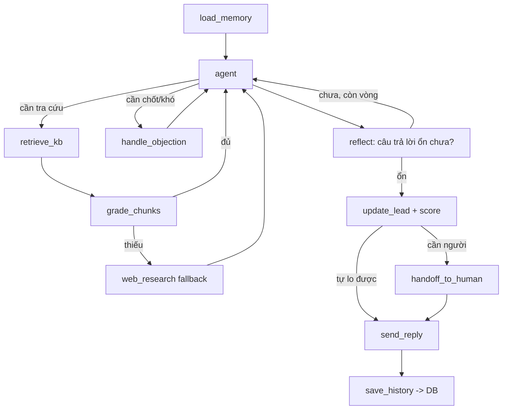

# Tuyển Sinh Concierge — Brainstorm high-level

> Chatbot **tư vấn tuyển sinh + chốt lead tự động** cho trung tâm dạy học. Lead từ quảng cáo Facebook/Zalo → chatbot tự chăm sóc, trả lời khóa học/học phí/lịch, xin thông tin, và chốt tới đăng ký; chuyển tư vấn viên người thật khi cần.
>
> File này là **brainstorm high-level** — chốt xương sống kiến trúc để build riêng, KHÔNG đi vào code chi tiết.

## 1. Ý tưởng một dòng

Một **agent tư vấn tuyển sinh** trò chuyện qua Messenger/Zalo: ứng viên hỏi về khóa học → agent retrieve từ kho kiến thức của trung tâm → tư vấn (có dẫn nguồn nội bộ), **xin & lưu lead**, **đặt lịch học thử**, **xử lý phản đối để chốt**, và **chuyển người thật** khi gặp ca khó.

Bản chất kỹ thuật: một **Corrective-RAG sales agent** trên custom LangGraph — nâng cấp trực tiếp từ [[tea-concierge-design|Tea Concierge]].

## 2. Mục tiêu & phi mục tiêu

**Mục tiêu**
- Tự động chăm sóc & tư vấn lead 24/7, giảm tải cho tư vấn viên.
- Thu lead có cấu trúc (tên, SĐT, khóa quan tâm, độ nóng) → đẩy ra Google Sheet để chốt.
- Trả lời **đúng dữ liệu trung tâm** (chống bịa học phí/ưu đãi) → có dẫn nguồn nội bộ.
- Tận dụng đúng stack đã học: LangGraph StateGraph, tool-calling, RAG, reflection, structured output.

**Phi mục tiêu (YAGNI)**
- KHÔNG multi-agent supervisor (Hướng B) ở giai đoạn đầu — để dành khi có traffic thật.
- KHÔNG UI quản trị cầu kỳ sớm — lead ra Google Sheet là đủ.
- KHÔNG tối ưu chi phí/latency sớm — chạy tốt trước.
- KHÔNG tự thanh toán/đóng học phí trong bot — dừng ở "đẩy tới đăng ký + chuyển người".

## 3. Quyết định kiến trúc đã chốt

| Hạng mục | Quyết định | Lý do |
|---|---|---|
| Kênh | **Messenger + Zalo OA** là chính | Nguồn lead chính từ quảng cáo FB/Zalo |
| Phạm vi | **Mức 3 — full auto sale** + van thoát người thật | Bot gánh phần thuyết phục, nhưng lead giáo dục giá trị cao nên luôn có nút chuyển người |
| Kiến trúc agent | **Hướng A — Single LangGraph `StateGraph`** | Tái dùng pattern Tea Concierge; đủ mạnh cho Mức 3; gọn hơn multi-agent; kể được câu chuyện kiến trúc |
| Pattern RAG | Corrective-RAG: `grade` chunk → thiếu thì fallback | Chống hallucination; đúng concept đã học |
| Reflection | Loop đầy đủ (2–3 vòng) ở Pha 2 | Kiểm tra câu trả lời trước khi gửi (chống hứa bừa) |
| Thu lead | **State field + tool `capture_lead`** (structured output) | Thu lead = *hành động + trạng thái*, không cần agent riêng |
| Lưu trữ | Chat history → **DB hệ thống**; lead → **Google Sheet** | DB cho memory/audit; Sheet cho tư vấn viên chốt |
| Lộ trình | **Ship 2 pha trên cùng codebase** | Ra mắt nhanh (Pha 1 lễ tân), nâng cấp không đập đi xây lại (Pha 2 auto-sale) |

## 4. Kiến trúc tổng thể

Bốn tầng, backend chung cho cả hai kênh:

```
┌─────────────────────────────────────────────────────────┐
│  TẦNG KÊNH (Channel Adapters)                            │
│  Messenger webhook  ─┐                                   │
│  Zalo OA webhook    ─┴─►  Normalizer → Message thống nhất │
│  (nhận tin, gửi tin, phân biệt user theo channel_user_id)│
└───────────────────────────┬─────────────────────────────┘
                            │  (user_id, text, channel)
┌───────────────────────────▼─────────────────────────────┐
│  TẦNG BỘ NÃO (LangGraph StateGraph) — "tư vấn viên"      │
│  load memory → agent ⇄ tools → grade/reflect → reply    │
└──────┬───────────────────────────────────┬──────────────┘
       │                                   │
┌──────▼─────────┐              ┌───────────▼──────────────┐
│ TẦNG KIẾN THỨC │              │ TẦNG DỮ LIỆU             │
│ KB khóa học    │              │ - Chat history (DB)      │
│ + Vector store │              │ - Lead → Google Sheet    │
│ (RAG)          │              │ - Lead profile / state   │
└────────────────┘              └──────────────────────────┘
```

**Điểm cốt lõi:** một `channel adapter` mỏng quy tin nhắn về một dạng chung → **một bộ não LangGraph duy nhất** xử lý → trả kết quả về đúng kênh. Thêm kênh mới sau này (vd website) = viết thêm một adapter, không đụng bộ não.

## 5. LangGraph — State & Graph

### 5.1 State (bộ nhớ mỗi cuộc chat)

```python
class ConvState(TypedDict):
    messages: list           # lịch sử hội thoại (nạp từ DB theo user)
    user_id: str
    channel: str             # "messenger" | "zalo"
    retrieved: list          # chunk KB đã lấy (kèm nguồn để trích dẫn)
    lead_profile: LeadProfile
    sales_stage: str         # mới → đang tư vấn → đã xin SĐT → đã chốt / cần người
    reflect_count: int       # đếm vòng reflection
    handoff: bool            # cờ chuyển người thật

class LeadProfile(TypedDict):
    ten: str | None
    sdt: str | None
    khoa_quan_tam: str | None
    nhu_cau: str | None          # vd "con mất gốc tiếng Anh lớp 6"
    do_nong: str                 # "lạnh" | "ấm" | "nóng"
```

### 5.2 Graph (các node)



- **`load_memory`** — nạp lịch sử + lead_profile của user từ DB (nhớ xuyên phiên).
- **`agent`** — lõi `create_agent`/`bind_tools`, quyết định nói gì / gọi tool nào.
- **`retrieve_kb` + `grade_chunks`** — Corrective-RAG: lấy chunk, chấm liên quan; thiếu thì fallback.
- **`handle_objection`** — *(Pha 2)* node chuyên gỡ phản đối ("học phí đắt", "để suy nghĩ").
- **`reflect`** — *(Pha 2)* tự kiểm câu trả lời (không bịa giá/ưu đãi, giọng phù hợp) trước khi gửi.
- **`update_lead + score`** — trích lead ra structured output, chấm độ nóng, đẩy Sheet.
- **`handoff_to_human`** — set cờ + báo tư vấn viên.
- **`save_history`** — ghi hội thoại vào DB.

## 6. Tools (hành động của agent)

| Tool | Việc | Pha |
|---|---|---|
| `retrieve_kb(query)` | Tra kho kiến thức khóa học (RAG), trả kèm nguồn | 1 |
| `capture_lead(profile)` | Trích lead → **structured output** → append Google Sheet | 1 |
| `book_trial(user, slot)` | Đặt lịch tư vấn/học thử (ghi Sheet/Calendar) | 1 |
| `handoff_to_human(reason)` | Chuyển tư vấn viên + notify | 1 |
| `score_lead(state)` | Chấm độ nóng theo tín hiệu hội thoại | 2 |
| `web_research(query)` | Fallback khi KB thiếu (tùy chọn, cẩn trọng) | 2 |

## 7. Tầng kiến thức (RAG) — cấu trúc lại thông tin

Thông tin đang rải rác → **bước quan trọng nhất là cấu trúc lại thành KB**. Template mỗi khóa (1 file / khóa):

```markdown
# [Tên khóa]
- Đối tượng: (vd học sinh lớp 6-9 mất gốc)
- Mục tiêu đầu ra:
- Lộ trình / thời lượng:
- Lịch khai giảng:
- Học phí + ưu đãi hiện tại:   ← trường dễ đổi, tách riêng để cập nhật nhanh
- Giáo viên:
- FAQ: (câu hỏi thường gặp + trả lời chuẩn)
- Chính sách: (bảo lưu, hoàn phí, học bù...)
```

- **Ưu đãi/học phí** tách thành mục dễ sửa vì đổi thường xuyên (khuyến mãi theo tháng).
- KB → embed vào **vector store**; agent luôn tra KB trước khi trả lời số liệu.
- Câu trả lời **dẫn nguồn nội bộ** → nếu KB không có, bot nói "để em kiểm tra và nhờ tư vấn viên phản hồi" thay vì bịa.

> [!warning] Nguyên tắc vàng
> Bot **không bao giờ tự chế học phí/ưu đãi/cam kết**. Số liệu chỉ đến từ KB. Không có trong KB → hỏi người thật.

## 8. Thu lead & chấm độ nóng

- **Thu tự nhiên trong mạch tư vấn**, không phải form cứng: bot xin SĐT khi có lý do ("để em gửi lịch khai giảng qua Zalo cho mình nhé").
- **`capture_lead`** dùng structured output → 1 dòng/lead ra Sheet: `tên · SĐT · khóa · nhu cầu · độ nóng · trạng thái · link chat`.
- **Chấm độ nóng** theo tín hiệu: đã hỏi học phí? cho SĐT? hỏi lịch khai giảng? xin học thử? → giúp tư vấn viên gọi lead nóng trước.

## 9. Van thoát — Human handoff

Bot chuyển người thật khi: khách yêu cầu gặp người · khách bực/khiếu nại · hỏi thứ ngoài KB · lead nóng cần chốt tay · bot lặp vòng không tiến triển. Khi handoff: set cờ (bot ngừng tự trả lời user đó), **notify tư vấn viên** kèm tóm tắt hội thoại + lead_profile.

## 10. Lưu trữ

| Dữ liệu | Nơi lưu | Mục đích |
|---|---|---|
| Lịch sử chat | **DB hệ thống** | Memory xuyên phiên, audit, phân tích, huấn luyện Pha 2 |
| Lead | **Google Sheet** | Tư vấn viên theo dõi & chốt; rẻ, ai cũng mở được |
| Lead profile / state | DB (theo user_id) | Bot "nhớ" người cũ, không hỏi lại |

## 11. Guardrails & rủi ro (sản phẩm thật)

- **Chống bịa số liệu** — chỉ trả lời học phí/ưu đãi từ KB; reflection kiểm tra trước khi gửi.
- **Chống cam kết sai** — cấm bot hứa "đảm bảo đậu/giỏi"; câu nhạy cảm → handoff.
- **Ràng buộc kênh** — Messenger/Zalo có cửa sổ 24h & policy gửi tin; tuân thủ để không bị khóa OA.
- **Chi phí** — quy mô vừa: dùng model cân bằng, cache KB, giới hạn số vòng reflection.
- **Riêng tư** — SĐT là dữ liệu cá nhân; chỉ lưu điều cần, thông báo cho user khi thu.

## 12. Lộ trình ship 2 pha (cùng một codebase)

- **Pha 1 — "Lễ tân thông minh" (Mức 2):** channel adapters + bộ não gọn (`load_memory → agent ⇄ retrieve_kb → capture_lead → book_trial → handoff → save`). Ra mắt nhanh, gom hội thoại thật.
- **Pha 2 — "Tư vấn viên" (Mức 3):** bật thêm `handle_objection`, `reflect` đầy đủ, `score_lead`, `web_research`. Tinh chỉnh bằng chính data Pha 1. **Không đổi xương sống — chỉ thêm node.**

## 13. Concept khóa học được áp dụng

| Concept đã học | Dùng ở đâu |
|---|---|
| Custom `StateGraph` | Toàn bộ bộ não |
| `create_agent` / `bind_tools` | Lõi agent ⇄ tools |
| Corrective-RAG (grade + fallback) | Tầng kiến thức |
| Reflection loop | Node `reflect` (Pha 2) |
| Structured Output | `capture_lead`, `score_lead` |
| Tool-calling | Tất cả tools |
| Memory (state + DB) | `load_memory` / `save_history` |

## 14. Mở rộng tương lai (khi có traffic thật)

- Tách sang **Hướng B** nếu một prompt không kham nổi (agent đàm phán học phí ≠ agent xếp lịch).
- Thêm kênh **website widget** (thêm 1 adapter).
- Dashboard quản trị thay Google Sheet khi lead nhiều.
- A/B test kịch bản chốt sale bằng data hội thoại đã thu.

---

> **Bước tiếp theo:** file này là high-level. Khi build, bắt đầu từ **Pha 1** — dựng channel adapter + KB (cấu trúc lại thông tin khóa học) + graph gọn. KB tốt quan trọng hơn agent phức tạp: *bot chỉ giỏi bằng dữ liệu bạn nạp.*
